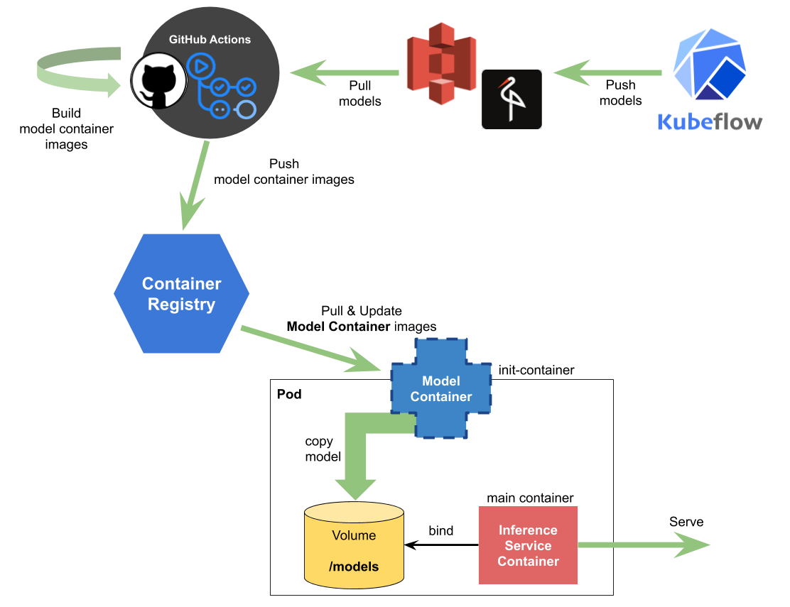

We will follow the below architecture with following customization for this demo purpose. 

Following are the steps we will walkthrough during this demo,

1. Build a Private Registry in K8 and expose them via NodePort to access across all worker nodes.

2. Build both application and model images from Source Code repository and push to private container registry.

3. Configure the application deployment with model data. Finally, wrap it up after some API testing to make sure everything is configured correctly.

**Note**: We don't cover the scenario's for kubeflow pipelines, pushing models into Minio / S3 etc. Instead we manually push everything to private container registry and take it from there.

We have clone the application repository for you and it can accessible via the following location,